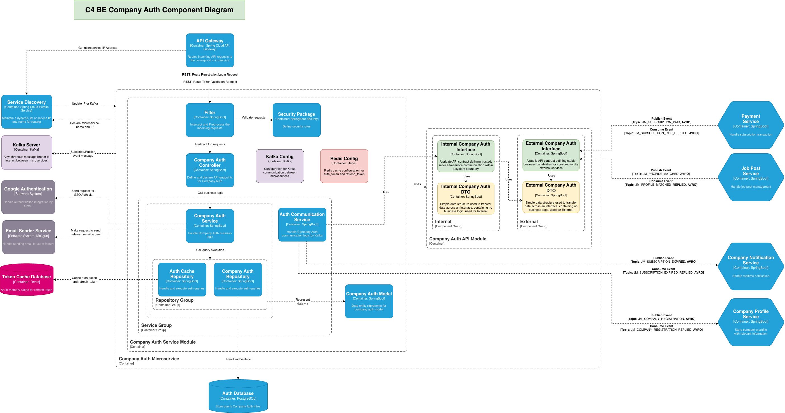

# Company Authentication Service

## 📸 Screenshots

  
  
<em>Company Auth Component</em>

## 👥 Developers

This project is developed by a team of students from RMIT University, Saigon Campus.

| Student Name      | ID       | School             | Roles       |
| ----------------- | -------- | ------------------ | ----------- |
| Nguyen Son Tung   | s3979348 | RMIT Saigon Campus | Team Leader |
| Pavel Potemkin    | s3963284 | RMIT Saigon Campus |             |
| Nguyen Tuan Dung  | s3927511 | RMIT Saigon Campus |             |
| Phan Trong Nguyen | s3927189 | RMIT Saigon Campus |             |

### Notes

Please follow [Conventional Commits](https://www.conventionalcommits.org/en/v1.0.0/) specification while commit.
